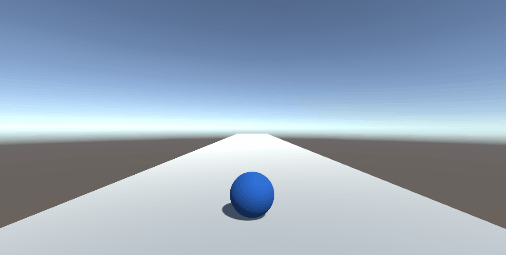
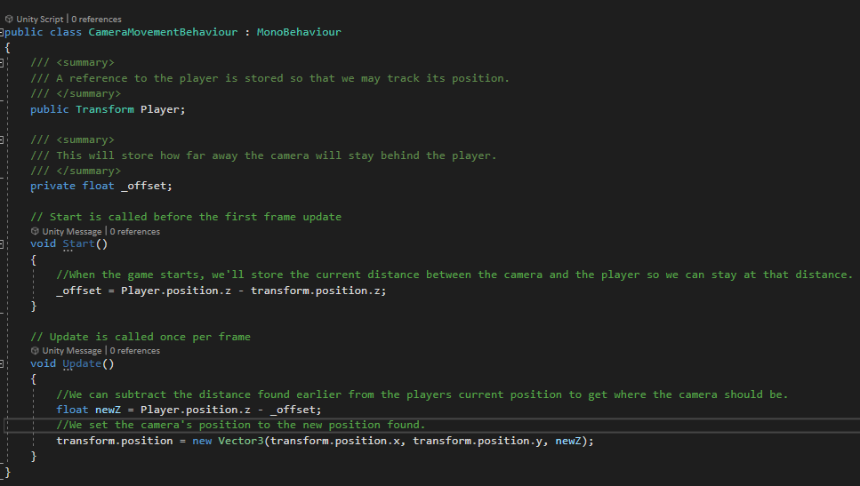
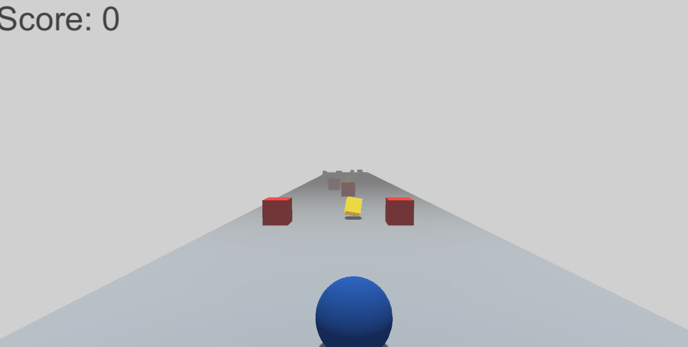

# Runner
In this tutorial, we'll be creating a simple game runner using a sphere as a our characters. We'll also see how we can use some simple techniques to add some life to our game.

# Setting Up The Scene
To start, create a platform for the player to walk on. To add a game object to the scene, either right-click or click the plus icon in the hierarchy window and select 3D object -> plane. Name this plane "Floor". Next we'll need to scale the floor so that our player has a bit more room to run. With the floor selected, the inspector window should show the object's components on the right. At the top of the component list there is the "Transform" component. Adjust the z axis to change the length of the level. You can set the length of the level to be whatever you like. I'm going to set the length for my level to 8. It's possible that the floor could spawn in a weird position due to the rotation and position of the camera in the scene view. Lets change the values of the position on all axis to be zero so that our level is at the center of our scene.

Next, let's add our player to the scene. Open up the 3D object creation menu we used before, but this time create a sphere and name it "Player". We now need to move the sphere so that it's at the beginning of our level. You can move objects by adjusting the position section in the "Transform" component at the top of the inspector. I set my player position to be -30 on the z axis and 0.5 on the y axis. You can also adjust the position of objects by first selecting them, and then clicking and dragging one of the arrows surrounding the object in the scene view. After placing the player at the beginning of the level, select the game tab at the top of the editor. This is what our player would see if they were to play our game now.

As you can see, our player is not in sight. This is because this tab shows us what the game will look like from the perspective from our main camera. To fix this we just need to move our main camera so that it's behind our player. Since my player is at -30 on the z axis, I'll set my camera position to be -35. I feel the camera is also a bit low, so I'll also set the y position to be 2. Now we should have a good view of our player.

Our camera is in the right position, but our player is still hard to see since our player and floor are the same color. We can add some color to the world by creating materials. In the project tab at the bottom, create a new folder called "Materials" by right clicking in the folder view and selecting Create -> Folder. Inside this folder, create a new material by right clicking again, but this time selecting "Create -> Material". Name the material "PlayerMat". If you select the material, you should see options for modifying the material on the right in the inspector. Click on the option labeled "Albedo" to adjust the color. I'm going to make the color of my player blue. Next, set the "Metallic" and "Smoothness" sliders to 0. This will make the player look less like plastic. 

To apply the material, simply drag the material on to the player in the scene. Repeat the same steps for the floor. 

# Adding Player Movement
Now that our playing field is set up, we can start adding some movement to our game. In the project tab at the bottom, create a new folder called "Scripts" by right clicking in the folder view and selecting "Create -> Folder". Inside this folder, create a new script by right clicking again, but this time selecting "Create -> C# Script". Name the script "PlayerMovementBehaviour". Modify the script so that it looks like this:

Back in Unity, attach the script to the player by either dragging the script on top of the player object, or by selecting the "AddComponent" button at the bottom of the inspector and typing the script name. Because we added the "Public" keyword before we declared our variable,we can edit the variable in the inspector. Set the forward move speed to be 8. If you play the game now, the player should start moving forward. 

It would be pretty difficult to dodge obstacles with our player moving so far from the camera. Let's create a new script called "CameraMovementBehaviour".

Attach the script to the game object labeled "MainCamera". You should be able to locate it easily in the "Hierarchy" tab on the left. Once the script is attached, drag and drop the player game object into the "Player" slot on the script. The camera should now follow the player and maintain the distance it starts at. 

Our player can't avoid obstacles by just moving forward, so let's add some side to side movement and input. Modify the movement script so that it looks like this: 

Let's also create a new script to get movement from the player so that they can move horizontally. Name the script "InputBehaviour". 

After attaching the script to the player, the player should be able move freely to either side. The only problem now is that the the player can move off the sides of the stage. We can fix this really easily by clamping the player's position. Modify the player movement script so that it looks like this:

Set the x minimum to be -5, and the x maximum to 5. Now the player should not be able to move off of the side of the stage.

Lastly, lets give our player the ability to jump. Jumping will allow us to make more interesting obstacles and terrain for our level. We'll be jumping by adding a force upwards to our player character, so we'll need to add a physics component. Select the player, and click the "Add Component" button at the bottom of the inspector. The component we'll want to add is the "Rigidbody" component. With this component we can give our game object mass, apply gravity, apply forces to push it around the scene, etc. To add the ability to jump, modify the movement and the input scripts so that they look like the following:

Set the jump force value for the player in Unity to be 15 and play the game. You should now be able to jump by pressing the 'W' key. The only problem now is that the player is able to jump infinitely in the air. This is because we didn't specify when the player is allowed to jump. We need to tweak our movement system to that the player can only jump if they are on the ground.  

To start, double click on the player game object in the hierarchy tab to make the scene camera focus on it. Next we'll need to add a separate collider to the player that can check for floor collision. Right click on the player, select "3D Object -> Cube", and name the cube "GroundCollider". We need to change the position and scale of the cube so that it's just barely sticking out at the bottom of the sphere. If the cube isn't positioned correctly, our jumps can feel laggy and inconsistent. Set the scale on all axis to be 0.6 and Set the y position to be -0.2. 

Underneath the transform component, there is a component called "Box Collider". As the name implies, this is the object that's responsible for collision. By default all objects have solid collision; meaning it doesn't allow objects to pass through it. This is going to be a bit of a problem for us here. If our ground collider has solid collision, it would make our player stand awkwardly on top of it, and cause weird collision issues in the future. Fortunately Unity gives us a way to register collisions while allowing objects to pass through. Click the "IsTrigger" check box on the component to enable this feature.

Although the visual could be useful for debugging, our player doesn't need to see the cube in game. We can make the cube invisible by clicking on the check box near the "MeshRenderer" component. 

Next, we'll need to change the tag of the floor game object. This will make it easy to distinguish the collider for the floor from other game object colliders. Select the "Floor" game object in the hierarchy and click on the dropdown that says "Untagged" at the top of the inspector. Select the "Add Tag" option in the dropdown menu.

Click the plus icon to add a new tag, name it "Floor" and click save. Select the "Floor" game object again and click the "Tag" dropdown. This time select the new "Floor" tag that we created. Now that we have a collider and a label for our floor, we can create a new script that can detect collision with the ground. Create a new script and name it "GroundColliderBehaviour".

Attach that script to the ground collider object in Unity. Next, update the move script so that it uses the value set in the ground collider. We'll also add something else that will make our jump feel less weird and snappy in air.

Drag the ground collider into the "GroundCollider" slot, set the "AirSpeedScale" to 2, and play the game. The player can no longer jump infinitely! Now that our player is all done, create a new folder called "Characters" and drag the player game object into the folder. This will create a prefab for our player. It won't be too important now, but later it can be useful for updating our player across levels.

## Bonus Polish(Optional)

You can add a trail to our player character to make our movement look a bit cooler. To add a trail easily to objects in Unity, we just need to add a "TrailRenderer" component. Add this component to the player object. The first thing you'll want to do here is add the appropriate material. Click the materials dropdown and click on the plus icon. Click on the circle next to the new box to add a material. Search for the material "Default-Line" and select it.

At the top of the component should be a graph called "Width". This controls the width of the trail over time. For this, I think it would be nice if our trail started wide and narrowed as it progressed. To do this, we'll need to add another key. To add a key at the end, right click on the end of the width line and select add key.

Once the key is added, click and hold to drag it all the way down. This should give us a nice curve from start to end.

Now that we have the width sorted out, lets tweak the length. We're going to want to specify how long pieces of our trail should stick around for. We can tweak this by modifying the "Time" variable directly underneath the graph. You can make this number whatever you like. Just remember that the longer the value, the longer your trail will be. I'm going to set mine to 0.1.

Now we'll edit the color so that the trail is a bit more interesting to look at. Click on the "Color" section in the trail renderer component. This will open the gradient editor.

We don't have to pick a fixed color for our trail. The gradient editor makes it really easy to change the color of our trail from the start to the end. The top two notches control the transparency over time, while the bottom two notches control the color over time. For my character, I want their trail to start blue and fade out into orange. To do this, I'll first need to set the starting color. To set the starting color, click the first notch on the bottom and then select the "Color" section underneath it. After changing the color, it should give you something that looks like this:

Now our trail will start blue, but gradually transition to white. To change the end color, we just need to do the same thing for the last notch on the bottom. I also want the trail to fade out at the end, so I'm going to adjust the last notch at the top. The color option should now change to an alpha slider. I'm going to set my alpha at the end to 150, but this can be whatever you want it to be.

# Populating The Level

Now that our player can move freely in our level, it's time to start adding some objects to build out the environment. We'll start with creating obstacles for our player to dodge. Right click in the hierarchy tab and select "3D Object -> Cube". Name the cube "Obstacle". Just as we did before with the player, create a new material named "ObstacleMat" that has its roughness and smoothness settings set to 0. Drag the material on the obstacle game object to apply it. 

We'll need to create a new tag so that the player knows it collided with an obstacle. With the obstacle game object selected, click on the dropdown that says "Untagged" at the top of the inspector window. Select the "Add Tag" option. Click the plus icon, type "Obstacle", and click save. Navigate to the tag dropdown for the obstacle again, but this time select the new "Obstacle" tag. Similar to the ground collider from earlier, it would be better if our obstacle didn't have solid collision. Check the "Is Trigger" check box again to remove solid collision.

Now that our obstacle is labeled we can start adding logic to our script. Update the player move script so that it has the following changes:

Go back into Unity and create a new folder called "Environment". Drag the obstacle object into that folder to make it a prefab. Just as with our player, this will make it easier to make changes to multiple obstacles across levels. 

Now we can start populating our level with obstacles to give our player more of a challenge. To add a new obstacle simply drag and drop the obstacle prefab in the environment folder into the scene. You can position the obstacle however you'd like. I'm just going to throw a few into the scene for testing purposes. If you play the game now and run into an obstacle the player should now disappear.

Next we can create our win condition. In this game, we're going to say that the player won if they made it to the end of the stage. So all we'll do is create a collider that can detect when our player has reached the end of the stage. Create a new cube and name it "WinBox". Position the win box so that it's at the end of the level. Afterwards, we'll need to increase the scale of the box so that it's big enough to catch the player. It's important that the box is scaled in a way that allows it to be taller than the maximum jump height. For my game, I set the scale to be 10 on the x and 6 on the y. Adjust the scale and position so that the win box fits the conditions in your game. Just like the obstacle, you'll want to make the win box collider a trigger.

Next we'll create some logic to stop the player from falling off the stage once they win. Create a new script called "WinBoxBehaviour" and add the following code:

We want the player to stop moving once they have won, so we'll need to modify the move script to allow for movement to be stopped. Update the move script so that it looks like the following:

Go back to Unity and right click in the hierarchy tab and select "CreateEmpty". Name this empty game object "GameManager". This will just be used to store logic for transitioning levels, updating UI and of course handling the win condition. Create a new script called "GameManagerBehaviour". 

Attach the script to the game manager object in the scene view and drag the player and the win box in to their respective slots. If you play the game now the player should now stop when they reach the end of the level. Drag the win box and the game manager in the scene view into the environment folder to add them to our collection of prefabs.

Lets add some collectibles that our player can grab while they run through the level. We'll make these collectibles slowly rotate to make them stand out a bit more. Create a new cube in the hierarchy and name it "Collectible". With the game object selected, set the rotation on the x to be 45, and the z to be 45. Lets also set the scale of the object to be 0.7 on all axis. We can also add some color to our collectible by giving it a material. I'm going to make the color of my material yellow. You can also click on the emission checkbox to make the collectible stand out a bit more. 

Next we'll create a script that will make our collectible rotate. Create a new script called "RotationBehaviour" and add the following code:

Back in Unity, attach the script to the collectible in the scene. Set the rotation speed in the inspector to 50. Just like with the obstacles, we'll need to set a tag for the collectible so that the player knows when it collided with one. Just like before, create a new tag called "Collectible" and assign it using the tag dropdown menu in the inspector. Drag the collectible in the environment folder to make it a prefab. 

Collectibles still don't have a function. Since we want them to be a fun bonus and not the players main goal, we can just create a simple counter that keeps track of the amount we collected. In the player move script, add the following code:

## Bonus Polish(Optional)

We can make our scene look a little nicer by changing the the lighting and the skybox. We can get rid of the default skybox and make it a color that compliments our game more. Select the "Main Camera" game object in the scene and click the "Clear Flags" dropdown in the inspector. You can make the color whatever you like. I'm going to make mine a greyish-white. I've also changed the rotation of my "Directional Light" game object to be 90 on the x axis so that it faces straight down. Here's the effect I get:

Another thing we can do is add a bit of fog. This will allow our player to only focus on the obstacles that are directly in front of them. To add fog, select "Window -> Rendering -> Lighting" to get to the lighting settings. You can then click on the environment tab to tweak environment settings.

Scroll down until you reach the "Other Settings" section. Click on the "Fog" checkbox to enable fog. You can also choose how dense the fog is. I set my density to be 0.05. Once thats done, click the generate lighting button in the bottom right corner of the window to bake the new settings.

We can also create a cool explosion effect that can play when our player dies. We can do this by creating a particle effect. Right click in the hierarchy and select "Effects -> Particle System". Click on the particle system, and change the values in the inspector so they can match the following:

### Explosion(Top Level)
- Duration - 0.2

- Looping - Disabled

- StartDelay - 0

- Start Lifetime - 5

- Start Speed - 25

- Start Size - 0.2

- Start Color - Hex: 002193

- Gravity Modifier - 5

- Play On Awake - Enabled

- Stop Action - Destroy

### Emission
- Rate Over Time - 15
- Bursts(Add one new burst by clicking the plus icon) -
    - Time - 0
    - Count - 50
    - Cycles - 1
    - Interval - 0.01
    - Probability - 1

### Shape
- Shape - Sphere
- Radius - 0.93

### Collision
- Type - World
- Mode - 3D
- Dampen - 0.7
- Bounce - 1.5

### Trails
- Lifetime - 0.03
- Minimum Vertex Distance - 0.2
- Width Over Trail - Add new key at the end of the curve by right clicking and selecting the option.
You can then click and drag the key all the way down so the trail gets skinnier over life time.

### Renderer
- Render Mode - Mesh
- Mesh - Sphere
- Material - PlayerMat
- Trail Material - Default - Line

After the particle settings are complete, create a new folder called "Effects" and drag the particle effect in there to make it a prefab. Go to our player script and add the following code:

Back in Unity, grab the explosion prefab and drag it into the explosion slot on the player.

# Adding UI

Our player has a score, but we have no way to show it! We also don't have any messages indicating a win or lose state which can be very confusing for anyone playing our game in a vacuum. To fix all these problems we'll need to add some UI. 

We can start by adding something to display the current score. In the hierarchy right click and select "UI -> Text". You can name this text object "ScoreCounter". In the inspector
 window we can tweak the look and position of our text. The first thing we want to do here is move our textbox so that it's in a better position. We could just drag and drop the object like we did with all the other, but that would cause problems later on if the screen size changed. So instead we'll change the position using anchors. To put it simply, we'll be setting the point on the screen that the textbox will try to stick to when the screen size changes. To set an anchor, click the anchor icon on the "Rect Transform" component. 

This will open a menu that allows us to pick which part of the screen we want the textbox to be anchored to. If we hold the "alt" key while clicking, Unity will move the textbox in addition to setting the anchor. The score counter would probably look best in the top left so I'll choose that option.

Our text is pretty small. Our player would probably have to squint to read the score properly. To fix this, lets increase the font size. You can increase the font size by increasing the value in the "Font Size" box under the "Text" component. Let's set the font size to be 46. 

Doing this will make our text disappear. This is because the text is now too big to fit into the textbox! To fix this, we'll need to adjust the width and height of our textbox. You can find those values at the top of the inspector in the "Rect Transform" component. Set the width to be 350 and the height to be 60. This should make our text visible again but you may see that it is slightly out of place. To fix this, we can simply reset the anchor holding the "alt" key to set it back to its previous position. While we're in the anchor menu it would also be a good idea to click the stretch option in the bottom right corner. This will make it so that our UI stretches as the screen size changes.

Now we can create a script that can update the score. Create a new script called "ScoreTextBehaviour" and add the following code:

With this done go back to Unity and attach the script to the "ScoreCounter" game object. Drag and drop the player into the player slot and try to grab some collectibles in game!

Next lets create win and lose screens for our game. We'll make an effect that will fade in text over the screen to make a smooth transition. Right click on the Canvas game object and select "UI -> Panel". You can name it "Background". The panel is semi-transparent by default, but we want it to start completely transparent so we can fade it in. In the inspector, click the "Add Component" button and add the "Canvas Group" component. This will make it to where anything that's attached to the "Background" game object will have the same transparency as the "Background". Next let's add some text by right clicking the "Background" game object and selecting "UI -> Text". We can name this text "WinText". We can keep this textbox anchored in the middle, but we'll still need to adjust the size of the text. Set the font size to 48, the width to 600, and the height to 120. We want all of our text here to be centered, so under the "Paragraph" section select both center options for alignment. 

Change the text in the textbox to "Level Cleared" and set its color to a dark green. Now that the text itself is set up, we're going to want to disable the game object so the text doesn't always appear. You can turn off a game object by clicking the checkbox at the top of the inspector.

The lose text should be formatted the same as the win text. All we'll need to do is change the color and the text in the textbox. We can save ourselves some time by just duplicating the win text. To duplicate a game object, select it and press "Ctrl + d". You can name this new game object "LoseText". Change the text to "Level Failed" and the color to a dark red. Just as we did with the win text, we should turn off the the textbox so it doesn't always appear. Lastly, we'll want to make our "Background" object disappear so it isn't always blocking the game view. Instead of turning off the game object though, we'll just change the "Alpha" value in the "Canvas Group" component to 0. 

Create an empty game object and name it "UIManager". Next we'll create a script that can store and modify our UI elements. Create a new script called "UIManagerBehaviour" and add the following code:

Now we'll also need to update our game manager so that it loads the right screen based on the game state. Add the following code to the game manager:

Attach the "UIManagerBehaviour" script to the "UIManager" game object in the scene view. Drag and drop the "Background" game object into the "Game Over Panel" and "Background Image" slots. Then drag the win and lose textbox into their respective slots. You can set your fade speed to be whatever you like. I have my fade speed set to 1 second. Lastly, drag and drop the UI manager in the "UIManager" slot on the game manager. Now we have a smooth transition to an end screen for our game!

Now that our base game is complete, try to create your own levels! Add different challenges and obstacles like gaps to jump over, rotating obstacles, or harder to reach collectibles. 
